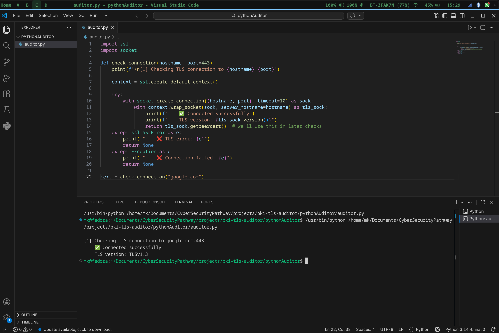

# Phase 3: Python TLS Auditor

[← Root README](../README.md) · [← Phase 2](../phase2_NginxConfig/README.md) · [Phase 4 →](../phase4_breaking/README.md) · Full build log: [NOTES.md](https://github.com/mk2514k/PKI_TLS_Auditor/blob/main/phase3_pythonAuditor/phase3_notes.md)

## Core Phase Objective

This is the script that validates everything the first two phases set up. It connects to a live TLS server, runs six checks against it nd produces a timestamped pass/fail report that explains every failure in plain language. Not just *what* failed, but *why* it matters and what to do about it. By the time Phase 4 runs (where I deliberately break things), the auditor needs to be reliable enough that its output is actually trustworthy. Writing it before the breaking phase wasn't optional, it's the whole point.


## How to run it

```bash
cd phase3_pythonAuditor
python3 auditor.py
# Enter hostname to audit: server.cyberpathway.lab
```

The report prints to terminal and saves automatically to a timestamped `.txt` file in the same directory:

```
tls_report_server.cyberpathway.lab_20260629_120313.txt
```

## The checks

### Check 1: TLS Connection

The first check, and the gatekeeper for everything else. If the server won't complete a TLS handshake, there's nothing to audit.

It uses `ssl.create_default_context()` loaded with the root CA cert as the trust anchor. This matters because this is a private CA — without loading the root cert explicitly, Python's default SSL context will reject the connection outright since it doesn't know about our CA.

Two failure modes are handled separately:
- `ssl.SSLError`: the handshake started but failed (protocol mismatch, untrusted cert, config error on either side)
- `Exception`: the connection didn't even start (server down, DNS not resolving, wrong port)

Both failures explain what they mean and what to look at. The caller gets `None` back, which cascades through and causes Check 2 to skip gracefully rather than crash.



### Check 2: Certificate Expiry

Reads the `notAfter` field from the cert returned by Check 1, parses it into a UTC datetime, and checks how many days remain.

Three states:
- **Expired**: days left is negative. Hard FAIL. An expired cert is rejected outright by every modern TLS client, no grace period.
- **Expiring within 30 days**: FAIL with warning. Flagged because renewal takes time and a missed window is one of the most common causes of unplanned outages. 30 days is a reasonable runway.
- **Valid**:  PASS, reports the exact date and days remaining.

If Check 1 returned `None` (connection failed), Check 2 skips cleanly and reports why, it doesn't try to read expiry from a cert that doesn't exist.

### Check 3: Hostname / SAN Match

This one fetches the raw cert in a second connection with cert verification *disabled* (`ssl.CERT_NONE`). That sounds counterintuitive, but it's intentional, the point of this check is to read and inspect what's actually in the cert's SAN extension, regardless of whether the cert itself is trusted. If verification was enabled, a cert with a mismatched SAN would just fail the connection before you could see what names it actually contained.

The check parses the SAN extension using the `cryptography` library (more flexible than `ssl`'s built-in cert parsing), extracts all `DNSName` entries, and checks whether the hostname you're auditing appears in that list. Wildcard matching is included, `*.cyberpathway.lab` correctly covers `server.cyberpathway.lab`.

If there's no SAN match, the output explains why this matters: modern TLS clients ignore the CN field entirely and only check SANs. A cert with the right CN but no SAN, or a SAN pointing at the wrong hostname, will fail, and the error message tells you exactly which SANs were present so you know what to reissue with.

### Check 4: Cipher Suite

Connects, negotiates a cipher, and checks the negotiated cipher name against a dictionary of known-weak entries:

| Cipher / Mode | Vulnerability |
|---|---|
| RC4 | NOMORE attack (2015): practical plaintext recovery |
| DES | 56-bit key: trivially brute-forced with modern hardware |
| 3DES | SWEET32 birthday attack: 64-bit block size |
| MD5 | Collision attacks practical since 2004 |
| NULL | No encryption: plaintext traffic |
| EXPORT | FREAK attack (2015): forced downgrade to 512-bit RSA |
| ANON | No server auth: trivially MITM-able |
| CBC | POODLE, Lucky13 padding oracle attacks |

The cipher name gets checked against every key in this dictionary with a substring match, so a cipher like `AES128-CBC-SHA` would match on `CBC`. If a match is found, the output names the specific weakness and the relevant attack. It doesn't just say "weak cipher", it says *why* that cipher is weak and what the attack is called.

The `SSLCertVerificationError` fallback here was added during Phase 4 (see the Phase 4 notes for why that was needed).

### Check 5: Chain of Trust

Attempts a fully verified TLS connection- the SSL context loads the root CA cert and verifies the entire chain. If the chain is valid all the way up to the trusted root, it passes and prints the Subject and Issuer from the cert.

The failure path is where this check earns its keep. `ssl.SSLCertVerificationError` gets caught and the output explains the two most common causes:

- **Missing Intermediate**: the server is only serving the leaf cert. Clients without the Intermediate cached can't complete the chain walk. Fix: serve a cert bundle (which is exactly what Phase 2's `server-chain.pem` solved).
- **Self-signed cert**: has no chain at all, vouches only for itself. Fix: reissue through the Intermediate CA.

The explanation also calls out something subtle: this failure is often invisible during basic testing because the machine that built the CA usually has the Intermediate locally, so the chain walk works fine from there. It breaks for other clients. That distinction matters when you're debugging.

### Check 6: Protocol Version

This check deliberately sets `ssl.CERT_NONE` and lowers the minimum TLS version on the context so it can actually negotiate older protocols if the server allows them. Without this, Python's SSL stack would refuse to even attempt a TLS 1.0/1.1 connection, meaning the check would always pass even if the server was allowing those versions.

The negotiated version gets checked against a dictionary of deprecated protocols:

| Protocol | Vulnerability |
|---|---|
| TLS 1.0 | BEAST attack, deprecated RFC 8996 (2021) |
| TLS 1.1 | Deprecated RFC 8996 (2021), lacks AEAD cipher support |
| SSL 2.0 | Fundamental design flaws, no message tamper protection |
| SSL 3.0 | POODLE attack (2014) |

The fix recommendation names the exact Nginx directive to change (`ssl_protocols TLSv1.2 TLSv1.3`) so someone reading the output knows immediately where to go.

## Report output

Every run saves a report to a timestamped `.txt` file. The format is consistent across all six checks — status, detail line, and on failure, a plain-English "Why" and "Fix":

```
============================================================
  TLS Audit Report
  Target   : server.cyberpathway.lab
  Generated: 2026-06-29 12:03:13
============================================================

[PASS] TLS Connection
  Detail     : Connected. TLS version: TLSv1.3

[PASS] Certificate Expiry
  Detail     : Valid for 362 more days (expires 2027-06-29)

[PASS] Hostname / SAN Match
  Detail     : SANs on cert: ['server.cyberpathway.lab'] — 'server.cyberpathway.lab' matched

[PASS] Cipher Suite
  Detail     : Cipher: TLS_AES_256_GCM_SHA384 | TLS: TLSv1.3 | Key bits: 256

[PASS] Chain of Trust
  Detail     : Subject: server.cyberpathway.lab | Issuer: mk-intermediateCA

[PASS] TLS Protocol Version
  Detail     : Negotiated protocol: TLSv1.3

============================================================
  Audit complete.
============================================================
```

Real pass and fail reports from the Phase 4 breaking exercises are in [phase4_breaking/](../phase4_breaking/).

Full code walkthrough, design decisions, and mid-build adjustments are in [NOTES.md](https://github.com/mk2514k/PKI_TLS_Auditor/blob/main/phase3_pythonAuditor/phase3_notes.md).

.png)
%20.png)
